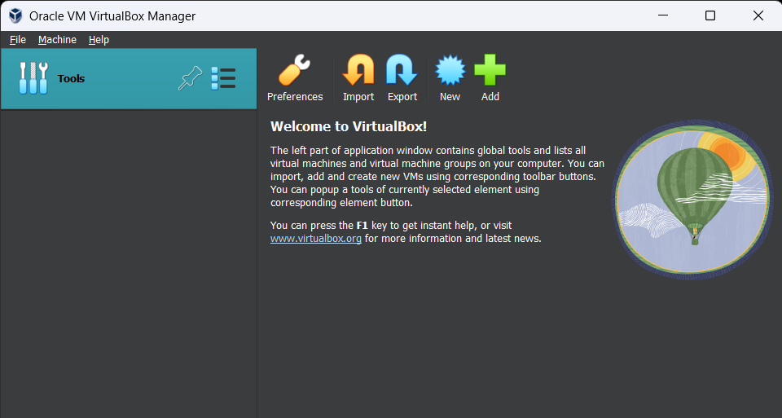
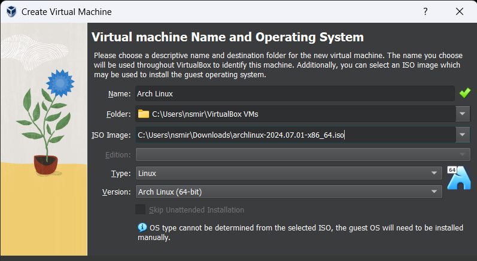
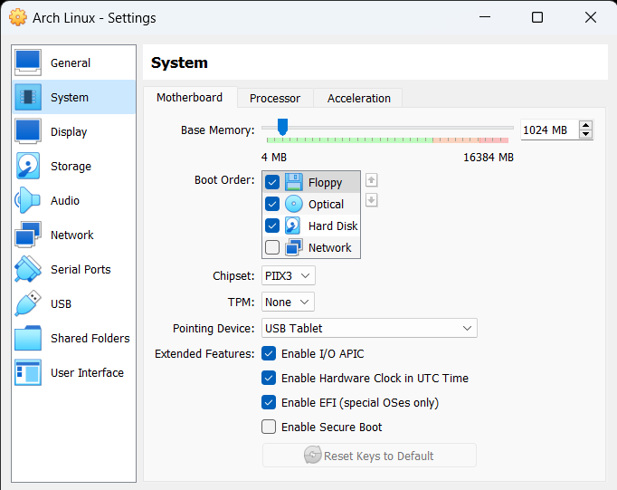
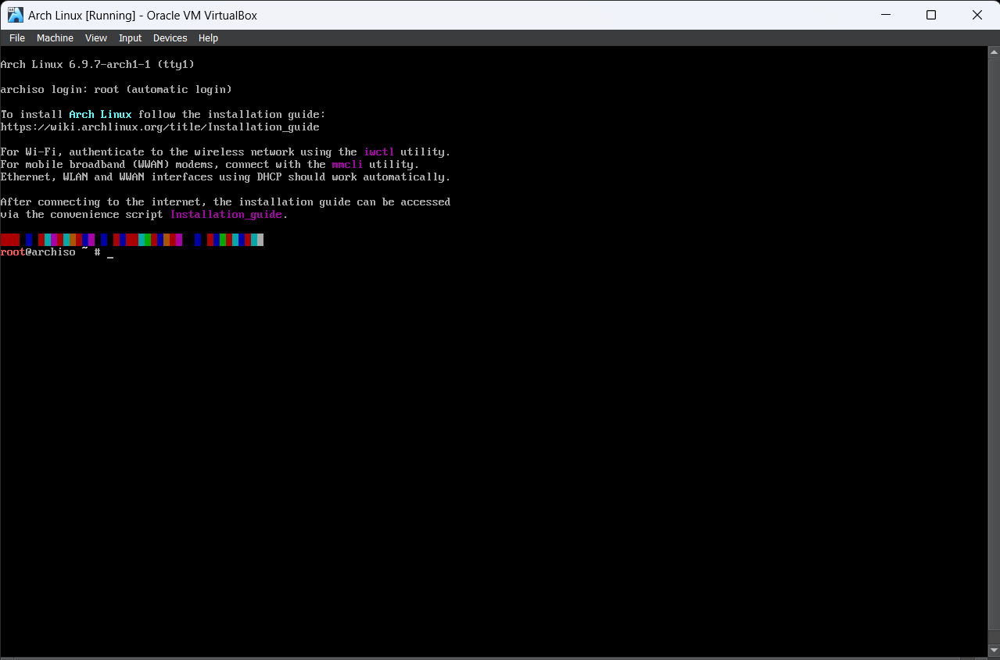
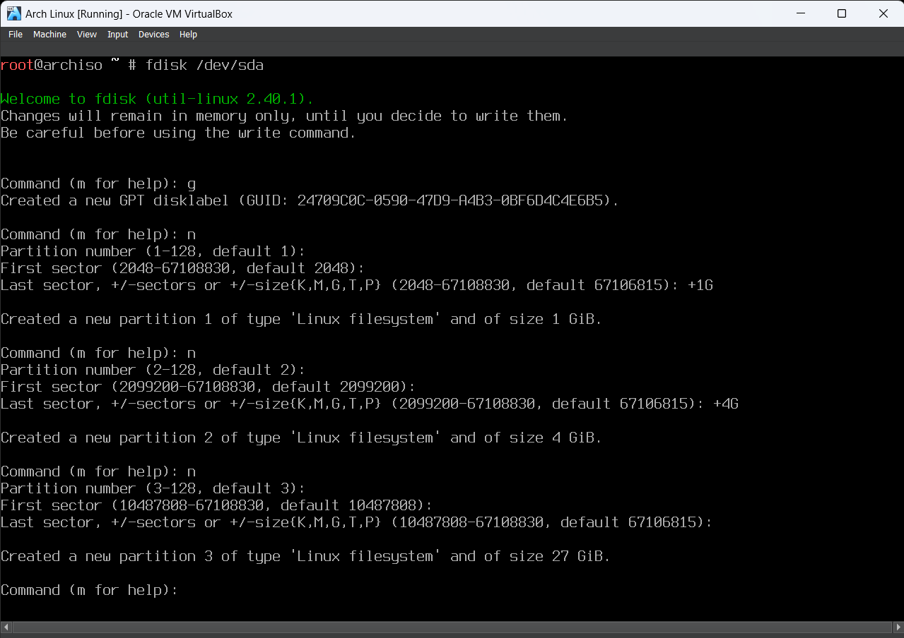
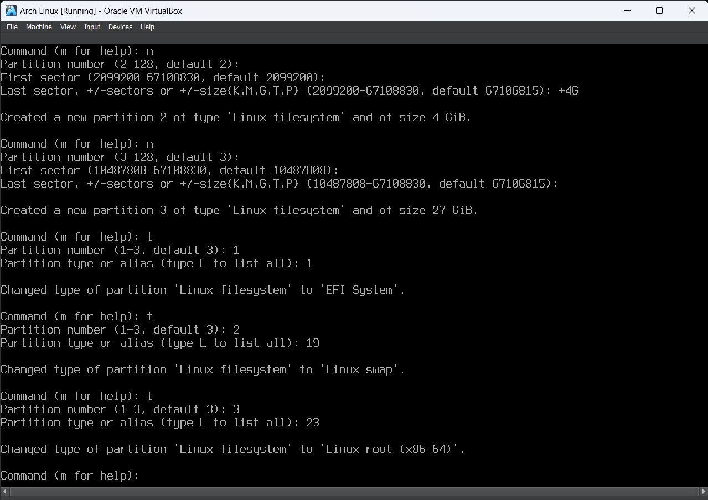
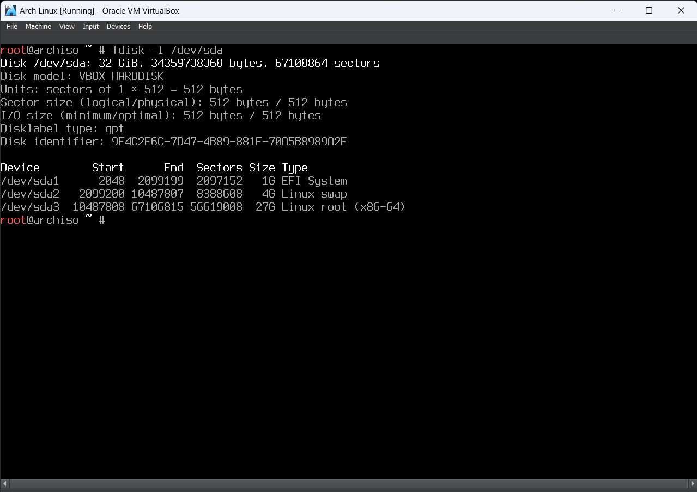
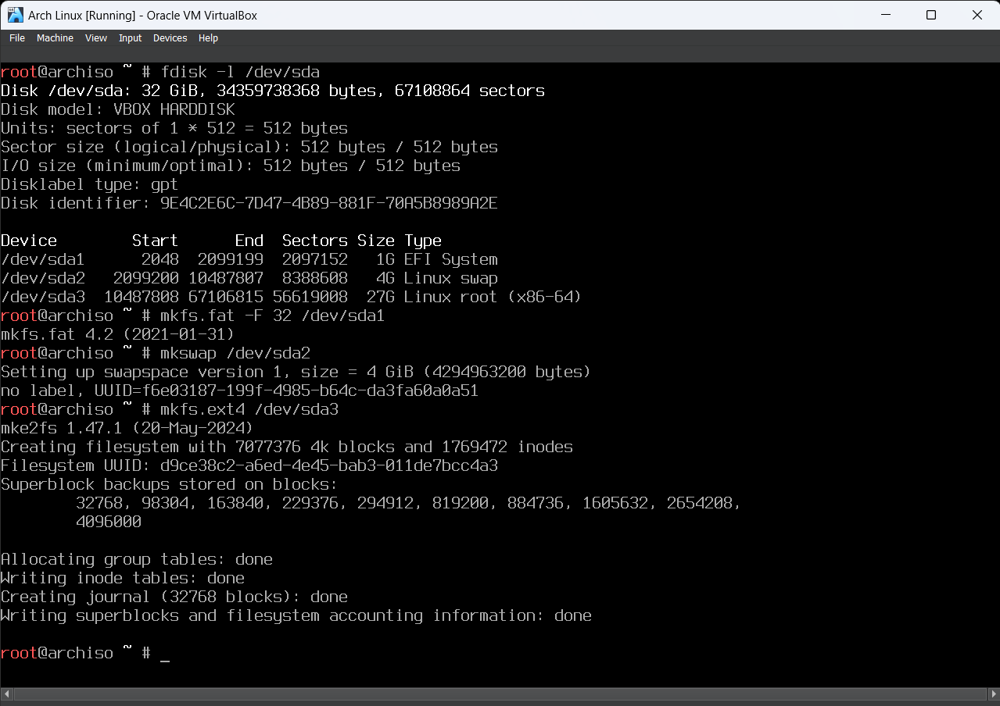

# Arch Linux Guide

[Arch Linux](https://archlinux.org) is often regarded as one of the most complicated and advanced systems to use.
Ironically, it's actually the opposite in some sense. According to the main page, it is a distribution that tries to Keep It Simple.
You may regard Arch as something like C Programming Language from the world of Linux destributions.
It is simple in the sense that there is nothing else other than bare minimum utilities required for system to operate.
But it is certainly not simple in the sense that it does not provide convinient tools for users out of the box to 'make life easier'. Neccesary things only.
This minimalism is something that often attracts curious minds that attempt to explore a mysterious world of Linux because it is a challenge to install and configure, especially compared to other distributions.
As someone who has a little experience in Linux world, this distribution attracted me as well. 
After successful installation and configuration, I decided to write this guide.

## Why does this guide exist?

A reasonable question, especially considering that an [official guide](https://wiki.archlinux.org/title/Installation_guide) already exists. 
This is really a nice guide, so it is worth regarding it as a primary source of information.
Nevertheless, my guide attempts to uncover mysteries of Arch to those, who already knows the basics, but yet unfamilliar with peculiarities of system administration.

There is only one prerequisite knowledge required: ability to use terminal and understanding of basic commands (`ls`, `cd`, `mkdir`, `rm`, `cp`, `cat`, `less`, etc).
Some commands may be new for you, but you should know how to use `man` in that case.
And one last thing before we start: I strongly recommend you to use a virtual machine, because it is safe to screw up here, gives more control of hardware configuration and makes my guide more specific.
For example, consider [Oracle VirtualBox](https://www.virtualbox.org/). It's nice and free.

## Downloading and Signature Checking

Firstly, download an image from the [official website](https://archlinux.org/download/).
You can download an image either using a torrent client, or from HTTP servers.
To see a list of HTTP servers, scroll down a bit.
If you are on Linux, there are detailed instructions in the official guide provided to check a file signature using GPG.
Download a signature file from the same place you used to download a distribution image.
If you are on Windows 10 or higher, you can use built-in PowerShell to check an image file hash.
I assume that your file is located at the Downloads folder as by default, otherwise replace path with the path of your image.

```
Set-Location $Env:UserProfile\Downloads
(Get-FileHash .\filename | Select-Object -ExpandProperty Hash) -eq 'sha256hash'.ToUpper()
```

Replace `filename` with the name of your downloaded .iso image, and `sha256hash` with actual SHA256 hash specified on the website.

## Configure Virtual Machine

After downloading and signature checking are taken care of, let's get started with configuration of the virtual machine. 
I assume that you are using VirtualBox. Otherwise, use internet or carefully examine your application in order to find required options and parameters.



You can see above how a Virtual Box window looks like. Notice a panel with icons above. Click 'New' here to create a virtual machine.
Call it 'Arch Linux' or however you would like. At 'ISO image' field click at the arrow at the right side and select 'Other' from the dropdown menu. Select your downloaded .iso image here.



After that, click 'Next'. Configure Hardware properties however you like. Default values of 1024 MB and 1 CPU core are sufficient for Arch distribution.
On the next screen, configure a hard disk properties of your system. Default values would suffice, but I would recommend you to change Disk Size to 32 GB.
On the final screen check out configuration details and click 'Finish'. We are done here.
There is one last thing I'd like to do before we boot. Let's set up EFI in our system. EFI is an architecture of a platform firmware used for booting a computer.
To put it simply, it is a modern replacement for classic BIOS.
To set up EFI, click at the 'Settings' at the icon panel, go to 'System' at the menu on the left, and tick 'Enable EFI' in the 'Extended Features' section. Click 'OK'.



## Launch Virtual Machine

Let's boot into the live environment. Live environment is a temporary image of a system where many things are configured for you and you can interact with the system.
However, configurations are set up to default values, and everything is resetting to those defaults after you reboot the machine.
For this reason, we would only use it to install our system. 
Live environment is stored on the .iso image you downloaded earlier, and is automatically set up at the virtual optical drive. 
Hard drive, however, is a place where our system will be eventually installed. It is empty and unpartitioned at the moment.
To boot our system, click 'Start' at the icon panel.
You will see a boot menu. Just press 'Enter'.
After that, you will see a virtual terminal where you would be logged in as a 'root' user.
It would look something like this.



## Initial Configuration

If you want, you can skip right to the partitioning section. 
However, I would recommend you to read this section, especially if you want to know how to configure things like keyboard layout, locale, date, time and font.
Those parameters will not be transferred to your installed system but it is useful to know how to configure them beforehand.

### Set up keyboard layout

Firstly, let's set up a keyboard layout. For most people default would suffice. But it is useful to know if your keyboard layout is different from US.

Available layouts can be listed like this:

```
localectl list-keymaps
```

Use arrow keys or 'J'/'K' to move up and down, and hit 'Q' to quit. After you find layout you need, type

```
loadkeys us
```

Replace 'us' with the layout you need.

### Set up console font

Also, consider setting up a console fonts to make output more readable. To list all fonts, type

```
ls /usr/share/kbd/consolefonts/ | less
```

After you find the font you need, load it with

```
setfont ter-124b
```

Replace 'ter-124b' with the font you need.

### Check the boot mode

Check your boot mode by typing

```
cat /sys/firmware/efi/fw_platform_size
```

If you enabled the EFI as was mentioned above, you would see your system type. In most cases, that would be '64'.
If you did not enabled EFI, you would see a message, that file was not found, so turn off your virtual machine, and enable EFI now.

### Check internet connection

Now, let's check our connection to Internet. Let's list your network interfaces.

```
ip link
```

Check your interfaces. They should be listed and marked as enabled ('state UP').
In most cases, DHCP configuration should work out of the box.
Check your connection by sending packages to some website.

```
ping archlinux.org
```

After four lines of output or so, press 'CTRL+C'. Check out the last line.
If you see `0% packet loss`, you are good.

### Check system clock

Finally, check out the system clock. If you are connected to the Internet, it should be configured out of the box.
Check your clock by typing

```
timedatectl
```

'System clock synchronized' should display 'yes'.

## Partitioning

Partitioning is 'slicing' of the disk into pieces, each of which has a special purpose.
This is probably one of the most difficult parts of this guide. 
Stay with me and read everything carefully before trying that out. 
If you see that you made a mistake during partitioning in `fdisk`, type 'q' to discard all changes and type fdisk command again to start from scratch.

Firstly, let's check our disks.

```
fdisk -l
```

You should see a list of your disks. You can ignore 'loop' devices. 
If you followed this guide, you would probably see just one disk called `/dev/sda`.
Let's partition it.

```
fdisk /dev/sda
```

You will see an interactive prompt. Let's convert our disk from MBR to GPT.
It is more modern partitioning system. Just type 'g'.

Now, let's create our partitions. Our partition scheme would look like this

| Partition No | Partition Size | Partition Type |
|--------------|----------------|----------------|
| 1            | 1G             | EFI System (1) |
| 2            | 4G             | Linux Swap (19)|
| 3            | 27G            | Linux Root (23)|

To create a new partition, type 'n'. Then, just type 'Enter' two times. Defaults would suffice here.
Now when you are prompted to type 'Last sector ... or size ...', type size of our partition. For first partition, that would be '+1G'.
You will see a message of successfull partition creation. 
Repeat this process two more times. One thing that will differ in this process will be a partition size (the last option).
At the second time, specify the size as '+4G', and at the third, just hit 'Enter' (this will allocate all remaining space)



Output of your terminal should look like that on the image above.

Now, let's change types of our partitions.
To change type of a partition, type 't'. Then, specify a partition number. Let's start from 1.
Lastly, specify a partition type. It is specified in parenthesis in the table above. For first partition it is 1.
Now, repeat this process two more times. For each partition, specify according partition number (2 and 3) and according partition type (19 and 23, respectively).



Output of your terminal should look like that on the image above.
After you are done with partitioning, type 'w' to save all changes.

Phew, that probably was not an easy one. 
I tried to write a description concisely to avoid repitition, so that may not be very clear, but I provided a terminal screenshots. 
That is not much better, but if you would read *really* carefully, there should be no problems.

## Formatting

We sliced our disk to partitions, but they are empty right now.
We need to format our partitions with the file system, so that our computer can work with them.
Before we start, let's check out our partitioning table.

```
fdisk -l /dev/sda
```



You would see an output like one above. If that's not the case, you messed up somewhere, so go at the section above and redo everything from scratch.

Let's start with the EFI System partition, which is marked as `/dev/sda1`. We will format it with FAT file system.

```
mkfs.fat -F 32 /dev/sda1
```

Then, let's format our Linux Swap partition (`/dev/sda2`) with a Swap filesystem.

```
mkswap /dev/sda2
```

Finally, we format our last partition (`/dev/sda3`) with Ext4 filesystem.

```
mkfs.ext4 /dev/sda3
```



Terminal should not yell at you here.

## Mounting

Now we partitioned our disk and formatted all partitions to the required file systems. 
We are almost done with the disk.
One last thing remains, though: we need to mount our partitions.
That is, we need to to 'plug' our partitions to our main filesystem, so that we can use them.

Order of our partitions here would be a little different, because we have to respect filesystem hierarchy while mounting partitions.

Firstly, let's mount our root partition. Mounting point for root is located at `/mnt`.

```
mount /dev/sda3 /mnt
```

Now, let's mount our boot device.

```
mount --mkdir /dev/sda1 /mnt/boot
```

Lastly, let's mount a swap partition.

```
swapon /dev/sda2
```

## Installing packages

Ideally, you should check out a list of mirrors and configure it so your download speed would be high.
But in most cases it is configured automatically by reflector, and you probably should not mess with it.

Now, our disk is partitioned, formatted, and mounted. We can use it now from our live environment.
Firstly, let's use a pacstrap script to install the bare basics on our disk.

```
pacstrap -K /mnt base linux linux-firmware
```

Those packages are absolute minimum and not include things that we would need later.
Downloading would probably take some time.
To install additional packages, let's temporarily change our root directory to our mount point.

```
arch-chroot /mnt
```

Now let's install additional packages using a `pacman` package manager.
You can read about additional packages at the guide page, but my list is as follows.

- CPU microcode: `intel-ucode`
- Filesystem utilities: `e2fsprogs`
- Console text editor: `nano`
- Documentation packages: `man-db`, `man-pages` and `texinfo`

```
pacman -S intel-ucode e2fsprogs nano man-db man-pages texinfo
```

Now let's leave our temporary environment (we will come back here very soon) and go back to the live image:

```
exit
```

## System configuration

### Create fstab

The last thing that we need to do before we return to our chroot environment is to generate so-called `fstab` file.
It is used to store configuration of disk partitioning and block devices.

```
genfstab -U /mnt >> /mnt/etc/fstab
```

### Go back to chroot

Now, let's come back to our chroot.

```
arch-chroot /mnt
```

### Set up time zone

We need to configure our time zone. To look at list of global zones, type

```
ls /usr/share/zoneinfo/ | less
```

Then, to list all regions in the zone, type

```
ls /usr/share/zoneinfo/Europe/ | less
```

Change Europe to your global zone here. After you found your time region, set it up with

```
ln -sf /usr/share/zoneinfo/Europe/Berlin /etc/localtime
```

Change Berlin to your region here. Now type this.

```
hwclock --systohc
```

### Set up localization

Now let's set up our localization. Open your localization configuration.

```
nano /etc/locale.gen
```

Find US UTF localization. To do that, type 'CTRL+F', then 'en_US', and press 'Enter'.
You should find your cursor at this localization. Remove a hash sign at the beginning of the line.
If you need other locales, look them up and remove hash signs there as well.
After you are done, type 'CTRL+O', then 'Enter', then 'CTRL+X'. Now type this.

```
locale-gen
nano /etc/locale.conf
```

Set up the LANG variable. To do that, type:

```
LANG=en_US.UTF-8
```

If you want to set your language to something else, replace en_US... with your locale.
Now, save it and exit ('CTRL+O', 'Enter', 'CTRL+X').

## Network configuration

Now comes another tricky part. We should configure internet on our system because even though in live environment it is configured out of the box, it is not the case for our system.

Firstly, let's configure our hostname.

```
nano /etc/hostname
```

Now, write in this file name of your machine (for example, `desktop` or something else).
Save your changes and close the file.

We need to configure our network. In most cases, you probably use DHCP, so my instructions suffice.
Otherwise, you have to read instructions on the official guide.

You can use pretty much any network manager, but I think that default network service is a good choice.
It is built in your system out of the box, so you don't have to install it.

At the moment, network service does not know about your network devices.
If you would try to install Arch on your computer, you would have to figure it out yourself.
But because you install it on the virtual machine, plan of actions should be clear.

Let's check out our network interfaces.

```
ip link
```

Ignore 'loop/loopback' device for now. Below it, you probably can see something like 'enp0s3'
One line below it you would see something like 'link/ether'.
This means that your interface has an ehternet device.

Among configuration files for network devices, there is one example configuration file for ethernet devices.
Let's find it among configuration files.

```
ls /usr/lib/systemd/network
```

Near the end of the input you probably can see something like '89-ethernet.network.example'.
It may be called slightly different, but 'ethernet.network.example' should be present.
Let's copy it from global configuration folder to local administration network directory.

```
cp /usr/lib/systemd/network/89-ethernet.network.example /etc/systemd/network
```

Now let's trim the '.example' suffix because it's going to be an actual configuration file.

```
mv /etc/systemd/network/89-ethernet.network.example /etc/systemd/network/89-ethernet.network
```

Generally, this file contains configuration that suffices for our purposes.

One last touch before we go to the next section. 
Let's enable our network services so they start after booting.

```
systemctl enable systemd-networkd systemd-resolved
```

## Root password

You need to configure your root password, because you will not be able to log in to your system without it.

```
passwd
```

Now just follow instructions on the terminal.

## Boot loader

One last thing before we reboot into our system.
Right now we have installed our system on the hard drive, but our computer (a virtual one) does not know how to load it. For that purpose, we would need a boot loader.
You can pick any one you want, but I would probably stick to the classical GRUB.

Let's install grub and efibootmgr packages first.

```
pacman -S grub efibootmgr
```

Do you remember a 'EFI System' partition that we created, formatted and mounted during our work with the disk?
It is a place where our bootloader will be located. Also, if you remember, we mounted it at `/mnt/boot`.
We are currently in chroot mode now, and our root is located at `/mnt`.
Therefore, our boot device is located at `/boot`.
Execute the following command to install EFI boot loader on our `/boot` device.

```
grub-install --target=x86_64-efi --efi-directory=/boot --bootloader-id=GRUB
```

Now we installed our boot manager, but at this point it has no idea what to do.
In order to fix it, we need to create a configuration file, which tells GRUB what we want.
Fortunately, you don't have to write it yourself. Instead, it can be generated automatically.

```
grub-mkconfig -o /boot/grub/grub.cfg
```

## Create a User

We are done with installation, and our system is ready. Let's boot into it.

```
exit
reboot
```

After reboot, you would see a login screen. Type in `root`, and then type a password, that you specified earlier.
You are finally logged in into your system.

Before you go to explore Arch system further, let's create a usual user (pan intended).
Why are we doing it? You see, `root` is a very special user. It has unlimited access to the system.
Up to the point where it can remove the whole system entirely (don't try to do that).
Besides, if anybody intercepts control of your device (via SSH, for example), they would gain a full control of your system.
Therefore, it's dangerous to work under the `root` all the time, because if you mess up here, you mess up really badly.
Let's create another user. I shall call it `user`, but feel free to call it as you want.

```
useradd -m user
passwd user
```

Before we log in as our new user account we need to take care of one last thing.
Our new account is a common user without much priveledges.
It means that you can't use it for administration tasks. To do that you need to log out and then log in as `root`.
It can become quite tedious, but more importantly, it's really easy to forget to log out from `root` account and use your computer as `root`.
At this point our new user becomes useless, and we go back to our security issue mentioned above.
To remedy that, firstly there was a `su` command to change user in-place, without logging out.
But that doesn't solve anything. It's just a tiny shortcut so that we don't have to log in as our `user` again.
Finally, a `sudo` command was created. Insted of changing user for the rest of the session, it just executes one command as a `root`. Right after that, we immediately go back to our `user` account.

Let's install a `sudo` package.

```
pacman -S sudo
```

Now let's configure it. You can set it up as you like, but the easiest (although not the most optimal) solution would be to allow any user to execute commands as a `root`, as long as they know `root` password.
It allows to take care of all users at once, and still requires authentification.

```
nano /etc/sudoers
```

Find line with 'Defaults targetpw'. Remove hash sign from beggining of this line and the next one.
Save this file and close the editor.

Finally, after all of those things are taken care of, you can log in as a new user.

```
exit
```

You will see a login screen. Type in `user` (or your user name), and password for that user.
Don't mess up passwords of your `user` and `root`. Congratulations, you did a great job!

## Conclusion

There is still so much more you can do and so much that you can discover.
No one guide would suffice to cover everything.
But there is a [nice list](https://wiki.archlinux.org/title/General_recommendations) of general recommendations you can do before you can complete configuration of your system.
